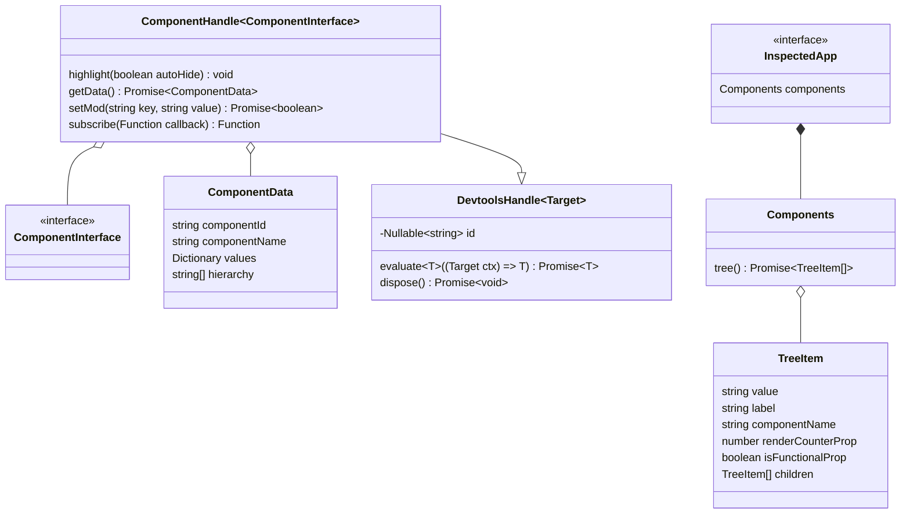

# V4Fire DevTools Core <!-- omit in toc -->

This is the source code for the V4Fire DevTools application which can be used
as the browser extension or standalone app.

The application must be written in an isomorphic way, it must not depend on any
exclusive APIs', such as: `chrome.runtime`, `chrome.devtools`, etc.

## Table of contents <!-- omit in toc -->

- [Quick Start](#quick-start)
- [Interaction with the inspected application](#interaction-with-the-inspected-application)

## Quick Start

1. Run at the root `yarn install`
2. `cd ./packages/v4fire-devtools-core`
3. `yarn dev`
4. Open new terminal and run `yarn start`
5. Open browser at `http://localhost:3333`

## Interaction with the inspected application

